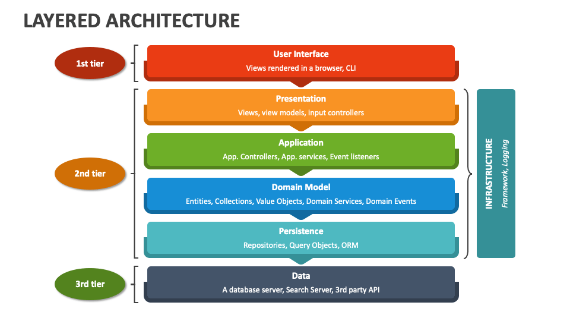

# 🧱 Week-01 Layered Architecture




## 📘 Definition

**Layered Architecture** is a software architecture model that organizes an application by separating its different responsibilities into distinct **layers**.  
Each layer is responsible only for its own tasks and interacts with other layers in a defined manner.

This approach ensures that:
- Code is **more readable**,  
- **Easier to maintain and test**,  
- **Modular** and **scalable**.

---

## 🧩 Main Purpose

The main goal of layered architecture is to implement the principle of **“Separation of Concerns”**, which means **dividing responsibilities**.

Each layer has a specific role:
- **Controller:** Handles user or client requests.  
- **Service:** Implements business logic.  
- **Repository:** Manages interactions with the database or other data sources.

---

## ⚙️ General Structure of Layers

The following structure is the most common pattern in modern backend systems:

Client → Controller → Service → Repository → Database

| Layer | Responsibility | Example |
|-------|----------------|---------|
| **Controller (Presentation Layer)** | Receives HTTP requests and directs them to the appropriate service | `GET /users` |
| **Service (Business Layer)** | Business rules, validation, computations, logical operations | “Email cannot be empty.” |
| **Repository (Data Access Layer)** | Interacts with the database or file system | `db.Find(&User{})` |
| **Model (Entity/Domain Layer)** | Structures representing data or domain entities | `User struct` |

---

## 💡 Layer Flow

1. **Client** (e.g., frontend or API request) sends an HTTP request.  
2. **Controller** receives the request and routes it to the appropriate **Service** method.  
3. **Service** applies business rules and, if needed, requests data from the **Repository** layer.  
4. **Repository** accesses the database and returns the results.  
5. **Service** performs any final business logic processing.  
6. **Controller** returns the response to the client in JSON or another suitable format.

---

## 🚀 Why Use Layered Architecture?

Layered architecture is considered a **best practice** in software development.

### ✅ Advantages

| Advantage | Explanation |
|-----------|------------|
| **Maintainability** | Each layer has a clear responsibility, making the code easier to understand. |
| **Testability** | Each layer can be tested independently. |
| **Independence** | Layers are isolated, so changes do not affect other layers. |
| **Reusability** | Service and repository code can be reused in other projects. |
| **Team Collaboration** | Different developers can work on different layers in parallel. |

### ⚠️ What Happens If Not Used?

- Code becomes **spaghetti** and hard to follow.  
- DB, business logic, and API code get mixed together.  
- Writing tests becomes very difficult.  
- Adding new features or refactoring is risky.  
- The application becomes unmanageable as it grows.

---

## 🌍 Real-World Usage

Most **backend projects worldwide** use layered architecture.

| Framework / Language | Layered Structure |
|----------------------|-----------------|
| **Spring Boot (Java)** | Controller → Service → Repository |
| **.NET Core (C#)** | Controller → Business Logic → Data Access |
| **Django (Python)** | View → Model (+ optional Service) |
| **NestJS (Node.js)** | Controller → Provider (Service) → Repository |
| **Go Fiber (Go)** | Controller → Service → Repository |

This architecture is used both in **monolithic systems** and as a foundation for **microservices**.

---

## 🔍 Difference from MVC

**Layered Architecture** and **MVC (Model–View–Controller)** are often confused.  
However, MVC is essentially a **UI-centric version of layered architecture**.

| Feature | Layered Architecture | MVC |
|---------|-------------------|-----|
| **Purpose** | Separates code by system responsibilities | Separates UI, data, and control |
| **Focus** | Backend and business logic | User interface (web app) |
| **Layers** | Controller – Service – Repository – Model | Model – View – Controller |
| **Scope** | Entire system | UI layer only |

> 💬 Every MVC is a layered architecture,  
> but not every layered architecture is MVC.

---

## 🔍 Benefits of This Structure

| Feature | Explanation |
|---------|------------|
| **Cleanliness** | Code is organized according to responsibility. |
| **Modifiability** | Changes in DB or API structure do not affect other layers. |
| **Testability** | Service layer can be tested independently. |
| **Reusability** | Repository or Service can be reused in other projects. |

---

## 🧭 System-Level Perspective

| Layer | Explanation |
|-------|------------|
| **Controller** | Acts as API Gateway or HTTP interface. |
| **Service** | Serves as the brain of the domain logic or microservice. |
| **Repository** | Handles the Data Access Layer (SQL, Redis, S3, etc.) |

> This structure forms the **foundation of microservice architectures**.  
> Many enterprise systems are built based on this architecture.

---

## 🧠 Summary

| Topic | Explanation |
|-------|------------|
| **Definition** | A model that separates an application into logical layers. |
| **Importance** | Ensures code is testable, readable, and extensible. |
| **Layers** | Controller, Service, Repository (+ Model, Config) |
| **Usage** | Used in almost all backend projects. |
| **Difference from MVC** | MVC is UI-centric; Layered Architecture is system-centric. |
| **Status** | ✅ Considered a **best practice** in the software industry. |

---

## 🧩 Conclusion

**Layered architecture:**
- Makes complex systems manageable,  
- Extends the lifecycle of code,  
- Allows parallel work by developer teams,  
- And forms a cornerstone for a backend engineering career.

---

> 🔑 **“A backend engineer cannot fully understand a system without understanding layered architecture.”**

## 🚀 Real World Demonstration: Go Fiber Layered Architecture

In this section, we'll explore the **Controller → Service → Repository → Model** flow through the `week-01-layered-architecture` sample project.

---

## 📂 Project Structure
```text
week-01-layered-architecture/
├── main.go
├── controller/
│   └── user_controller.go
├── service/
│   └── user_service.go
├── repository/
│   └── user_repository.go
└── model/
    └── user.go
```

---

## 🔄 Flow and Layer Responsibilities

### 1. **Model (`model/user.go`)**

| Layer | Responsibility | Inputs | Outputs |
|-------|---------------|---------|----------|
| Model | Represents the data (User entity) | N/A | `User` struct, e.g., `{ID, Name, Email}` |

---

### 2. **Repository (`repository/user_repository.go`)**

| Layer | Responsibility | Inputs | Outputs |
|-------|---------------|---------|----------|
| Repository | Provides data access, CRUD operations | `User` struct (Create), ID parameters (GetAll) | `User` list or created `User` |
| Example Functions | `GetAll()` → returns all users <br> `Create(user)` → adds and returns new user | `user model.User` | `user model.User` (with assigned ID) |

> The Repository layer **communicates directly** with the database or data source.

---

### 3. **Service (`service/user_service.go`)**

| Layer | Responsibility | Inputs | Outputs |
|-------|---------------|---------|----------|
| Service | Implements business logic, performs validation | `User` struct | `User` struct, error |
| Example Functions | `GetAllUsers()` → retrieves data from repository <br> `CreateUser(user)` → validates email, passes to repository | `user model.User` | `user model.User`, `error` |

> The Service layer **manages business logic** and forwards requests from the controller to the repository.

---

### 4. **Controller (`controller/user_controller.go`)**

| Layer | Responsibility | Inputs | Outputs |
|-------|---------------|---------|----------|
| Controller | Receives HTTP requests, calls Service layer, returns HTTP response | HTTP GET / POST requests, JSON body | JSON response (`User` list or new user) |
| Example Functions | `GetAll(ctx)` → returns all users <br> `Create(ctx)` → parses body and creates new user through service | HTTP Request body | JSON Response |

> The Controller layer **manages API endpoints** and returns data to the client.

---

### 5. **Main (`main.go`)**

- Starts the Fiber application.
- Creates the Repository → Service → Controller chain.
- Defines endpoints for Fiber:
  - `GET /users` → `userController.GetAll`
  - `POST /users` → `userController.Create`

> The Main function establishes inter-layer dependencies through **dependency injection**.

---


