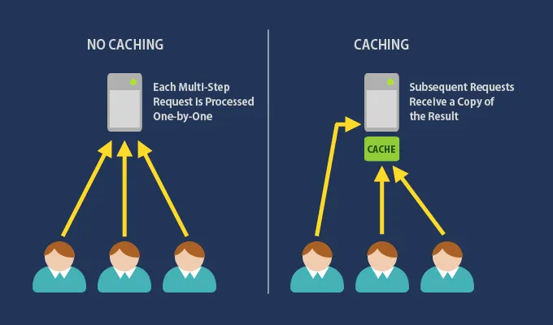
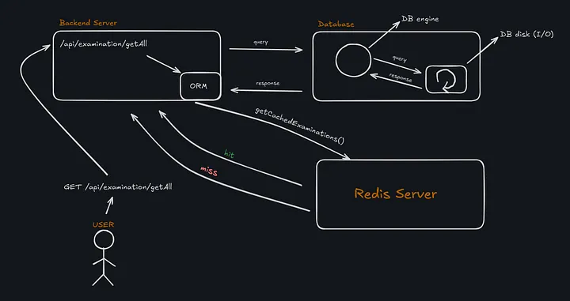
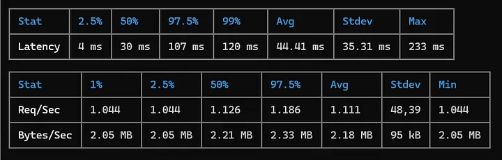

# Week 03: Cache & Redis

## Introduction

As a backend developer, when designing API endpoints, we should not only think at the user level but also consider the system as a whole at the system level. For instance:

- Will our system handle the increased number of users coming to the site?
- How can we ensure that our backend remains responsive under high load?
- Are the database queries within our API endpoints fast enough to serve requests efficiently?

These are critical questions that drive the need for robust performance optimization techniques like caching.

In this article, we will explore how caching, specifically using Redis, helps us optimize these challenges and improve the overall performance and scalability of our backend systems.

---

## What is Redis?


**Redis** (Remote Dictionary Server) is an open-source, in-memory data structure store. Unlike traditional databases, it stores data in RAM, allowing data reads and writes at microsecond speeds.

Redis supports not only simple key-value pairs but also advanced data structures such as:
- Lists
- Sets
- Hashes
- Sorted Sets

This versatility makes Redis indispensable not only for caching but also for:
- Messaging queues
- Real-time analytics
- Rate limiting
- Session management

---

## What is a Cache Mechanism?



Cache is a temporary storage that keeps frequently accessed data in a fast-access environment like RAM. For example, user profiles or product details that are frequently queried don't have to be fetched from the database every time, which:
- Improves speed
- Reduces resource consumption

### Types of Cache Strategies

#### 1. Cache Aside (Lazy Loading)
- Checks cache first
- If data is missing (cache miss), fetch from DB, write to cache, then return data
- Next requests get data directly from cache (cache hit)

#### 2. Write-Through
- Writes data to both DB and cache simultaneously
- Reads always come from cache, ensuring data consistency

#### 3. Write-Back (Write-Behind)
- Writes go to cache first; DB updates happen asynchronously in the background
- Write operations are fast but DB data may be slightly stale
---

## How Does Cache Work? — Example with Go Fiber



### Work Flow

Using the `/examination/getAll` endpoint as an example:

1. When a request comes in from the user, `getCachedExaminations()` is called first
2. This function checks Redis cache
3. If data is found (cache hit), it returns the data immediately
4. If data is not found (cache miss), it queries the database
5. The fetched data is then stored in Redis and returned to the user
6. Subsequent requests hit the cache, avoiding DB calls
---

## Performance Test and Statistics

### Test Environment

Load testing was performed using **Autocannon**, a fast HTTP benchmarking tool with the following parameters:
- Concurrent connections: 50 (`-c 50`)
- Duration: 10 seconds (`-d 10`)
- Endpoint: `http://127.0.0.1:3000/api/examination/getAll`

### 1. Without Redis Cache (First Test)

```bash
autocannon -c 50 -d 10 http://127.0.0.1:3000/api/examination/getAll
```



| Metric | Value |
|--------|-------|
| Total Requests | ~11,000 requests / 10 sec (≈ 1,100 req/sec) |
| Average Latency | 44.41 ms |
| Median (50%) Latency | 30 ms |
| Max Latency | 233 ms |
| Request Rate (Req/sec) | 1,111 avg |
| Data Transfer Rate | 2.18 MB/sec avg |

### 2. With Redis Cache (Second Test)

```bash
autocannon -c 50 -d 10 http://127.0.0.1:3000/api/examination/getAll
```


| Metric | Value |
|--------|-------|
| Total Requests | ~40,000 requests / 10 sec (≈ 4,000 req/sec) |
| Average Latency | 9.72 ms |
| Median (50%) Latency | 9 ms |
| Max Latency | 76 ms |
| Request Rate (Req/sec) | 4,024 avg |
| Data Transfer Rate | 7.94 MB/sec avg |
---

## Performance Comparison and Analysis

The performance test results clearly demonstrate the significant impact of Redis caching on backend system efficiency:

| Aspect | Improvement |
|--------|------------|
| **Request Rate** | ⬆️ ~3.6x increase (1,111 → 4,024 req/sec) |
| **Average Latency** | ⬇️ 78% reduction (44.41 ms → 9.72 ms) |
| **Median Latency** | ⬇️ Significant decrease showing overall consistency |
| **Max Latency** | ⬇️ 233 ms → 76 ms (smoother user experience) |
| **Data Transfer Rate** | ⬆️ ~3.6x increase (2.18 → 7.94 MB/sec) |
| **Total Requests (10s)** | ⬆️ ~11,000 → ~40,000 (massive capacity boost) |

### Key Insights

✅ The system can handle **significantly more requests** in the same amount of time  
✅ Responses are **much faster** on average and overall  
✅ **Smoother and more consistent** user experience even during heavy traffic  
✅ Data can be transferred **much faster** with Redis  
✅ Significant boost in overall **system capacity**
Conclusion
From a system-level perspective, Redis’s caching mechanism proves to be an extremely valuable practice for backend systems. By offloading repetitive read operations from the database, Redis not only enhances speed and responsiveness but also increases the overall resilience of the system under heavy load. This means that as user traffic scales, the backend can maintain consistent performance without the need for proportional database scaling. Furthermore, Redis’s in-memory architecture allows near-instant data retrieval, which is critical for applications where low latency and high throughput are non-negotiable. In essence, adopting Redis caching is not just a performance optimization — it’s a strategic system design choice that strengthens scalability, stability, and user experience at the core of the backend architecture.


### References / Sources
Redis Official Documentation — https://redis.io/docs/

Autocannon GitHub Repository — https://github.com/mcollina/autocannon

ne ulan bu? -redis cache — https://www.youtube.com/watch?v=THC5H8LF1jk&t=2s

1 Videoda #Redis Eğitimi — https://www.youtube.com/watch?v=JLS9gg-oJPQ&t=2790s